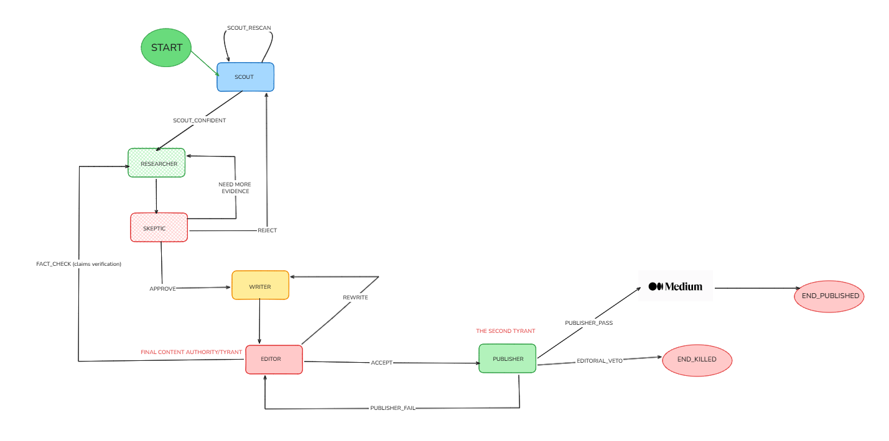

# 🤖 Newsroom.ai

> **Your AI-Powered Editorial Team That Never Sleeps**

Imagine a newsroom where AI agents work together like a real editorial team—discovering trending topics, researching them deeply, challenging assumptions, writing drafts, and polishing them to perfection. That's Newsroom.ai.

Six specialized AI agents collaborate through feedback loops and quality gates to create high-quality technical articles autonomously. No babysitting required.

[](https://www.python.org/downloads/)
[](https://github.com/langchain-ai/langgraph)
[](https://aistudio.google.com/)
[](https://opensource.org/licenses/MIT)

---

## 🎯 Why This Exists

**TL;DR:** Most AI content systems are glorified templates. This is different.

We built Newsroom.ai to solve a real problem: creating genuinely good technical content at scale. Not keyword-stuffed SEO garbage. Not generic "10 Tips for..." articles. **Real, researched, insightful content** that people actually want to read.

The secret? **Agents that disagree with each other.**

Just like a real newsroom, our AI agents have different jobs and different incentives:
- The **Scout** wants to find the hottest topics
- The **Skeptic** wants to kill hype and demand evidence
- The **Writer** wants to publish quickly
- The **Editor** demands perfection and will send drafts back for rewrites

This tension creates quality. It's messy. It's inefficient. **It works.**

---

## 🎭 Meet Your AI Editorial Team

| Agent | Personality | Superpower | Can Say "No"? |
|-------|-------------|------------|---------------|
| 🔍 **Scout** | Trend hunter, always online | Discovers what's hot on Reddit, ArXiv, DuckDuckGo News, Google Trends | ✅ Loops until confident |
| 📚 **Researcher** | Academic librarian | Deep research with proper citations | ❌ Neutral gatherer |
| 🤔 **Skeptic** | The cynic in the room | Challenges hype: "Is this *actually* new?" | ✅ Can reject outright |
| ✍️ **Writer** | Creative wordsmith | Turns research into compelling narratives | ❌ Follows orders |
| 📝 **Editor** | Perfectionist, brutally honest | Catches logic holes and hallucinations | ✅ Forces rewrites |
| 🚀 **Publisher** | Quality gatekeeper | SEO, formatting, duplicate checks, Reddit publishing | ✅ Final veto power |

**The magic:** Three agents can block progress. This creates feedback loops that improve quality with each iteration.

---

## 🔄 Why LangGraph? (The Honest Answer)

We tried building this with LangChain. It became spaghetti code in about 2 hours.

**The problem:** LangChain is great for linear workflows. But the moment you add:
- ❌ An editor who rejects drafts and sends them back
- ❌ A skeptic who demands more evidence
- ❌ Quality gates that can fail
- ❌ Loops that run until quality improves

...your code becomes an unmaintainable mess of if-statements and callbacks.

**LangGraph solves this** by treating your workflow as a graph with cycles:
- ✅ **Stateful memory** - Agents remember previous attempts
- ✅ **Explicit cycles** - Editor → Writer → Editor is a feature, not a bug
- ✅ **Branching logic** - Each agent decides where to go next
- ✅ **Observable execution** - You can see exactly what's happening

Think of it like Git vs. a linear file system. Once you need branches and merges, you need Git. Once you need feedback loops and quality gates, you need LangGraph.

---

## 🏗️ How It Actually Works

### The Workflow



```

Scout finds trending topic
    ↓
Researcher gathers evidence
    ↓
Skeptic reviews: "Is this legit?"
    ├─ No → Back to Scout (find a new topic)
    ├─ Need more → Back to Researcher
    └─ Yes → Continue
        ↓
Writer creates draft
    ↓
Editor reviews: "Is this good?"
    ├─ Needs rewrite → Back to Writer
    ├─ Needs facts → Back to Researcher
    └─ Perfect → Continue
        ↓
Publisher validates and publishes to Reddit
    ├─ Failed validation → Back to Editor
    └─ Success → END
```

**The graph has cycles.** That's the whole point. Quality comes from iteration.

### Real Example

Let's say Scout finds: *"New AI model claims 99% accuracy"*

1. **Scout** (confidence: 0.85): "This is trending on Reddit and ArXiv!"
2. **Researcher**: Gathers 8 sources, extracts claims with citations
3. **Skeptic**: "Wait, 99% accuracy *on what dataset*? Need more evidence."
4. **Researcher** (again): Digs deeper, finds the actual benchmark details
5. **Skeptic**: "Okay, this checks out. Proceed."
6. **Writer**: Creates draft with proper context and caveats
7. **Editor**: "This paragraph is confusing. Rewrite it."
8. **Writer** (again): Clarifies the confusing section
9. **Editor**: "Good. Ship it."
10. **Publisher**: Checks SEO, formatting, duplicates → Publishes to Reddit

**Total iterations:** 3 loops. **Time saved vs. human:** ~4 hours. **Quality:** Actually good.

---

## 🚀 Get Started in 5 Minutes

### What You Need
- Python 3.10 or higher
- A [Google Gemini API key](https://aistudio.google.com/app/apikey) (free tier available)
- PostgreSQL (for article storage)
- Redis (for caching)
- 5 minutes

### Option A: Docker (Recommended)

```bash
# Clone the repo
git clone <your-repo-url>
cd AI_NEWSROOM

# Copy and populate the environment file
cp .env.example .env
# Edit .env — set GEMINI_API_KEY at minimum

# Build and run with Docker Compose (includes PostgreSQL + Redis)
docker compose up --build
```

### Option B: Local Setup

```bash
# Clone and enter the project
git clone <your-repo-url>
cd AI_NEWSROOM

# Set up Python environment
python -m venv venv
source venv/bin/activate  # Windows: venv\Scripts\activate

# Install everything
pip install -r requirements.txt

# Copy and configure environment variables
cp .env.example .env
# Edit .env — set at minimum:
#   GEMINI_API_KEY=your-key-here
#   DATABASE_URL=postgresql://...
#   REDIS_URL=redis://localhost:6379/0

# Run the newsroom
python -m src.main
```

### Run Options

```bash
# Standard mode — run to completion
python -m src.main

# Streaming mode — see agent progress in real time
python -m src.main --stream

# Debug mode — verbose logging
python -m src.main --debug

# Save output to a specific file
python -m src.main --output ./output/my_article.md
```

You should see output like:
```
✅ Scout found: "Breakthrough in Quantum Error Correction"
✅ Confidence: 0.85
✅ Researcher gathered 12 sources
✅ Skeptic approved: sufficient evidence
✅ Writer produced draft (1,200 words)
✅ Editor approved after 1 revision
✅ Publisher: PUBLISHED
```

---

## 📊 Current Status

### ✅ Phase 1: Foundation (Complete)
- Base agent architecture (`src/agents/base.py`)
- State management system (`src/state.py`)
- Project structure

### ✅ Phase 2: Discovery & Research (Complete)
- **Scout Agent** — Finds trending topics from Reddit, ArXiv, DuckDuckGo News, Google Trends
- **Researcher Agent** — Deep research with citations
- **API Integrations** — Reddit JSON API, ArXiv, DuckDuckGo News, Google Trends
- **LLM Utilities** — Google Gemini integration via `langchain-google-genai`

### ✅ Phase 3: Content Creation (Complete)
- **Skeptic Agent** — Quality control and hype detection (`src/agents/skeptic.py`)
- **Writer Agent** — Draft creation with narrative structure (`src/agents/writer.py`)
- **Editor Agent** — Review, revision loops, hallucination checks (`src/agents/editor.py`)
- **Publisher Agent** — SEO checks, duplicate detection, Reddit publishing (`src/agents/publisher.py`)
- **LangGraph Integration** — All 6 agents connected with full conditional routing (`src/graph.py`)

### ✅ Phase 4: Infrastructure (Complete)
- **Async Architecture** — Fully async from top to bottom (`asyncio`)
- **Database Layer** — SQLAlchemy + asyncpg + PostgreSQL (`src/storage/database.py`)
- **Caching Layer** — Redis-backed async cache (`src/storage/cache.py`)
- **Docker** — Production-ready `Dockerfile` + `docker-compose.yml`
- **Logging** — Structured logging with file + stdout output

---

## 🛠️ Tech Stack

**Core:**
- **LangGraph** — Multi-agent orchestration with stateful cycles
- **LangChain** — LLM abstractions and message formatting
- **Google Gemini (`gemini-2.5-flash`)** — Primary language model

**Data Sources:**
- **Reddit** — Tech discussions (public JSON API, no key required)
- **DuckDuckGo News** — Breaking news discovery (no key required)
- **ArXiv** — Academic papers
- **Google Trends** — Search trend signals
- **GitHub** — Repository research (optional token)

**Storage:**
- **PostgreSQL + SQLAlchemy** — Article and research persistence
- **Redis** — API response caching (TTL-based)

**Infrastructure:**
- **Docker + Docker Compose** — Containerized deployment
- **asyncio / httpx** — Fully async I/O
- **PRAW** — Reddit publishing via the Reddit API

---

## 📁 Project Structure

```
AI_NEWSROOM/
├── src/
│   ├── agents/
│   │   ├── base.py          # BaseAgent with shared async execute() pattern
│   │   ├── scout.py         # Trend discovery agent
│   │   ├── researcher.py    # Deep research agent
│   │   ├── skeptic.py       # Quality-control agent
│   │   ├── writer.py        # Draft creation agent
│   │   ├── editor.py        # Review & revision agent
│   │   └── publisher.py     # Publishing & SEO agent
│   ├── storage/
│   │   ├── database.py      # SQLAlchemy async ORM layer
│   │   └── cache.py         # Redis-backed async cache
│   ├── utils/
│   │   ├── config.py        # Env-based configuration (Config, LLMConfig, ...)
│   │   ├── llm_utils.py     # Gemini client, prompt templates, token counting
│   │   ├── api_clients.py   # Async clients for Reddit, ArXiv, DuckDuckGo, Trends
│   │   ├── data_processing.py  # Text extraction and normalisation helpers
│   │   ├── logging_config.py   # Structured logging setup
│   │   ├── medium_playwright.py # Medium publishing via Playwright (optional)
│   │   └── reddit_publisher.py  # Reddit publishing via PRAW
│   ├── graph.py             # LangGraph workflow definition & routing functions
│   ├── state.py             # NewsroomState TypedDict + create_initial_state()
│   └── main.py              # CLI entry point with argparse + asyncio.run()
├── config/
│   └── agent_prompts.yaml   # YAML prompt templates for all agents
├── tests/                   # pytest test suite
├── Dockerfile               # Multi-stage production Docker image
├── docker-compose.yml       # App + PostgreSQL + Redis stack
├── .env.example             # All supported environment variables with comments
├── requirements.txt
└── pyproject.toml
```

---

## ⚙️ Configuration Reference

All configuration is driven by environment variables. Copy `.env.example` to `.env` and fill in your values.

| Variable | Default | Description |
|---|---|---|
| `GEMINI_API_KEY` | *(required)* | Google Gemini API key |
| `LLM_PROVIDER` | `gemini` | LLM backend |
| `LLM_MODEL` | `gemini-2.5-flash` | Gemini model name |
| `DATABASE_URL` | *(required)* | PostgreSQL connection string |
| `REDIS_URL` | `redis://localhost:6379/0` | Redis connection string |
| `SCOUT_CONFIDENCE_THRESHOLD` | `0.7` | Minimum confidence to proceed from Scout |
| `MAX_REVISION_LOOPS` | `3` | Maximum Editor→Writer revision cycles |
| `MAX_RESEARCH_SOURCES` | `10` | Sources gathered per Researcher pass |
| `REDDIT_CLIENT_ID` | *(optional)* | Reddit app client ID (for publishing) |
| `REDDIT_CLIENT_SECRET` | *(optional)* | Reddit app client secret |
| `REDDIT_USERNAME` | *(optional)* | Reddit account username |
| `REDDIT_PASSWORD` | *(optional)* | Reddit account password |
| `REDDIT_SUBREDDIT` | `artificial` | Target subreddit |

---

## 🎓 Learn More

### Key Concepts

**Why "Newsroom" and not "Pipeline"?**  
Pipelines are linear. Newsrooms have feedback loops, disagreements, and quality gates. That's what makes content good.

**Why do agents need to disagree?**  
Tension creates quality. If everyone agrees, you get groupthink. If the Editor can force rewrites, the Writer tries harder.

**How is this different from AutoGPT?**  
AutoGPT is one agent with tools. This is six agents with different goals. The architecture is fundamentally different.

**Why Gemini?**  
Google Gemini (`gemini-2.5-flash`) offers a generous free tier and strong instruction-following, making it practical to run this system at zero variable cost during development.

---

## 🤝 Contributing

We're building this in public. Contributions welcome!

**Areas we need help:**
- [ ] Additional data sources (GitHub trending, Hacker News, etc.)
- [ ] Better prompt engineering for agents
- [ ] Web UI for monitoring agent execution in real time
- [ ] Publishing integrations (Medium, Dev.to, Substack, etc.)
- [ ] Evaluation harness for article quality scoring

See [CONTRIBUTING.md](CONTRIBUTING.md) for guidelines.

---

## 📄 License

MIT License — Use it, fork it, build on it. Just don't blame us if your AI agents start arguing with each other. (They will. That's the point.)

---

## 💡 The Big Idea

**Most AI content systems are assembly lines.** Input → Process → Output. Fast, efficient, soulless.

**Newsroom.ai is a newsroom.** Messy, iterative, with agents that challenge each other. Slower, more expensive, **way better output.**

We believe the future of AI isn't about making it faster—it's about making it *think* better. And thinking requires disagreement, iteration, and quality gates.

**This is not a chain. This is a graph.**

And graphs are how real work gets done.

---

## 🙏 Acknowledgments

Built with [LangGraph](https://github.com/langchain-ai/langgraph) by LangChain.

Powered by [Google Gemini](https://deepmind.google/technologies/gemini/).

Inspired by every editor who ever sent our drafts back with "this needs work" written in red ink. You were right. We hated it. But you were right.

---

**Questions? Issues? Ideas?**  
Open an issue or start a discussion. We're figuring this out together.
